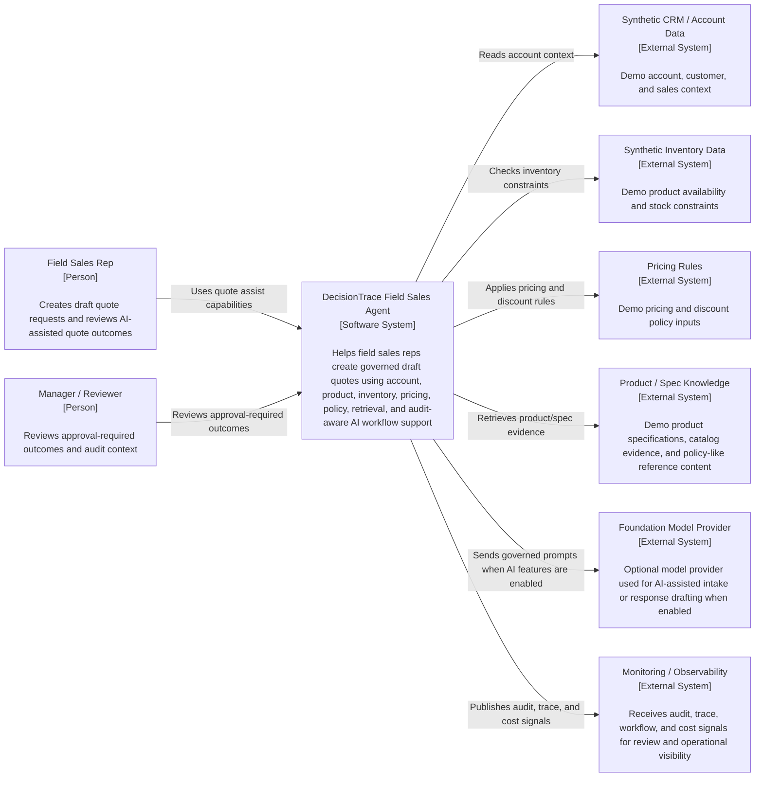

# C4 Level 1 — System Context Diagram: DecisionTrace Field Sales Agent

This diagram shows the DecisionTrace Field Sales Agent as a software system in its external ecosystem. It identifies the primary users, reviewer role, demo enterprise data sources, product/spec knowledge, foundation model dependency, and monitoring/observability relationship. Internal implementation details such as the API layer, LangGraph workflow, MCP layer, LlamaIndex retrieval, audit store, and cost telemetry store are intentionally excluded from this Level 1 view.

- This is the C4 Level 1 view.
- The DecisionTrace Field Sales Agent is shown as one software system.
- Internal containers are intentionally hidden and are shown in the Level 2 diagrams.
