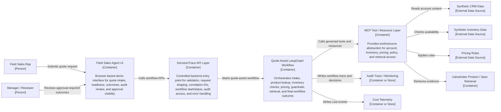

# C4 Level 2 — Container Diagram: Quote Assist Runtime Interaction View

This container-level view shows the primary runtime request path for the quote-assist workflow. It explains how a field sales rep uses the UI, how the UI enters the controlled DecisionTrace API layer, how the API starts the LangGraph workflow, and how the workflow reaches governed tools, resources, retrieval, audit, and telemetry capabilities.

- This is a Level 2 container-level runtime interaction view.
- It emphasizes the path of a quote request through the UI, API layer, workflow, MCP access layer, data sources, retrieval, audit, and cost telemetry.
- The DecisionTrace API Layer is not just a router; it is the controlled backend entry point that validates requests, shapes canonical payloads, establishes correlation IDs, starts workflows, exposes status/audit APIs, and protects internal orchestration from direct UI coupling.
