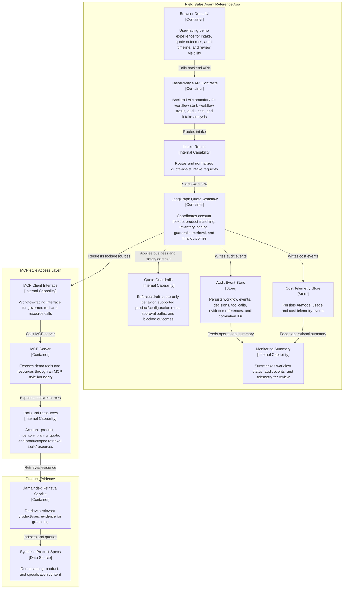

# C4 Level 2 — Container Diagram: Field Sales Agent Reference App Structure

This container-level view shows how the reference app is organized into major runtime areas: the Field Sales Agent reference app, the MCP-style access layer, and the product evidence retrieval area. Some boxes represent key internal capabilities within containers rather than independently deployable services; this is intentional for a public reference architecture diagram.

- This is a Level 2 container-level structure view.
- It groups the reference implementation into major runtime zones.
- Some boxes are labeled as internal capabilities to avoid implying that every box is a separately deployable container.
