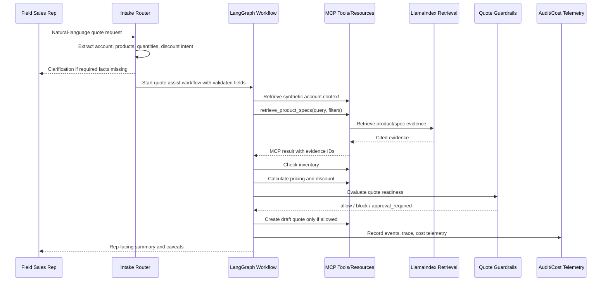
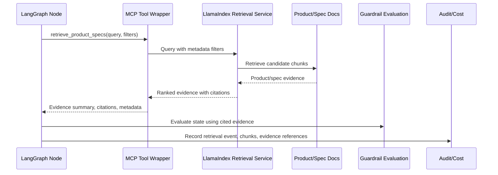
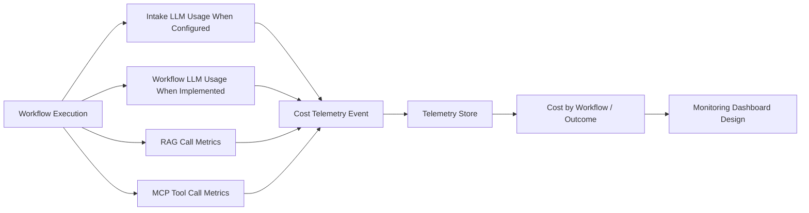
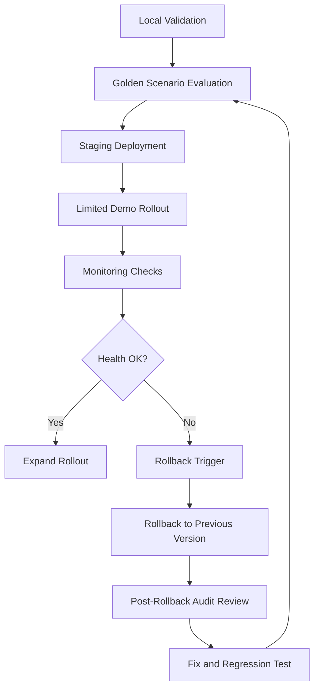
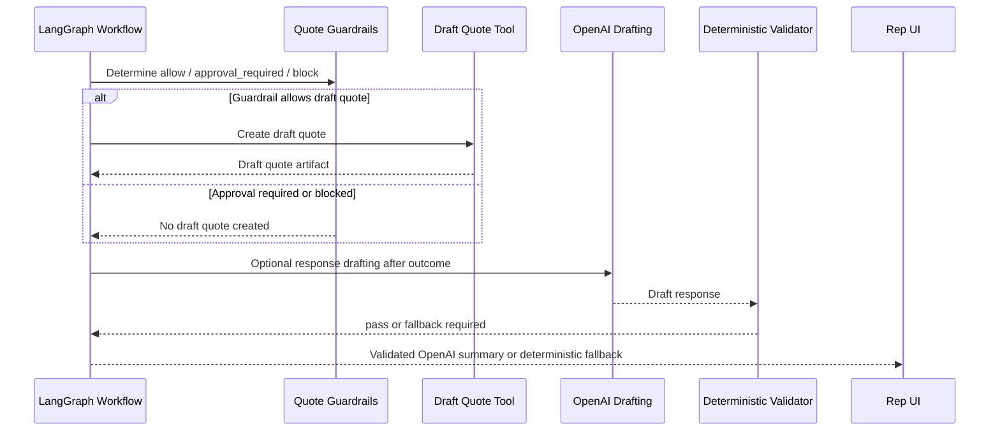

# Field Sales Agent Diagrams

These Mermaid diagrams are public-safe architecture diagrams for the DecisionTrace — Quote Assist Agent reference workflow. The Phase 1 release candidate has been validated against the public demo scenarios.

## C4 Architecture Views

1. [C4 Level 1 — System Context Diagram](architecture/01-system-context.md)
2. [C4 Level 2 — Container Diagram: Runtime Interaction View](architecture/02-container-runtime-interaction.md)
3. [C4 Level 2 — Container Diagram: Reference App Structure](architecture/03-container-reference-app-structure.md)

The two Level 2 views are complementary: the Runtime Interaction View explains the quote request flow, while the Reference App Structure view explains the app organization and major runtime zones.

## Additional Diagrams

### 1. Phase 1 Workflow Sequence

### 2. MCP + LlamaIndex Retrieval Sequence

### 3. Cost Telemetry Flow

### 4. Controlled Rollout / Rollback Flow

### 5. Post-Outcome Response Drafting Boundary

