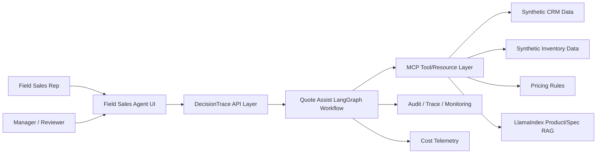
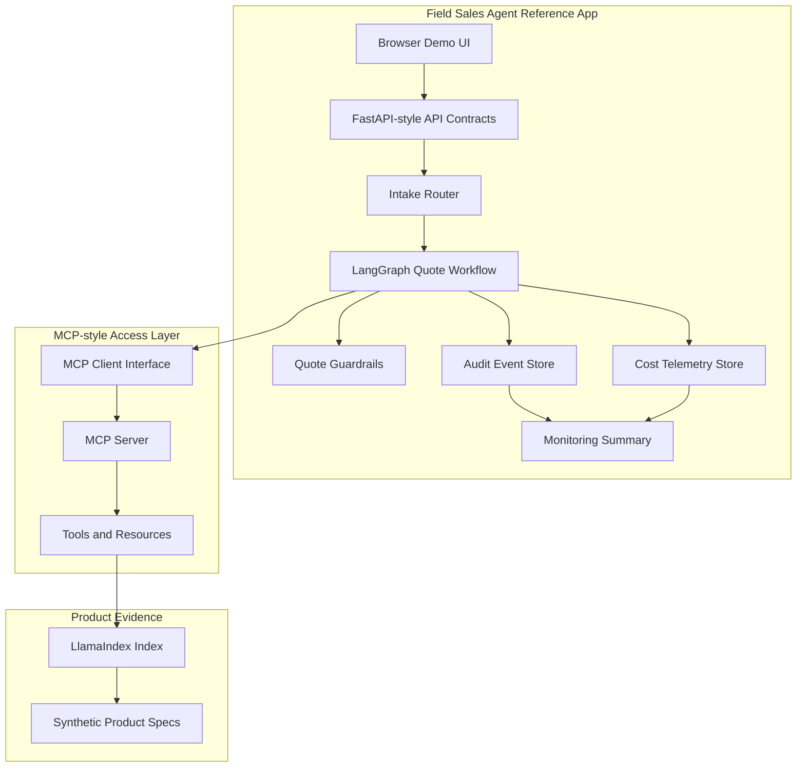
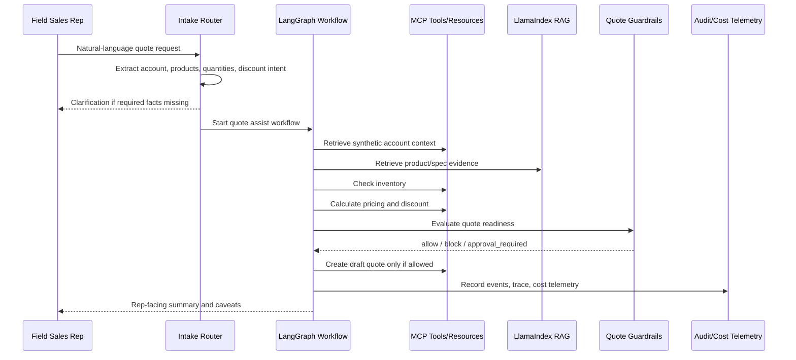
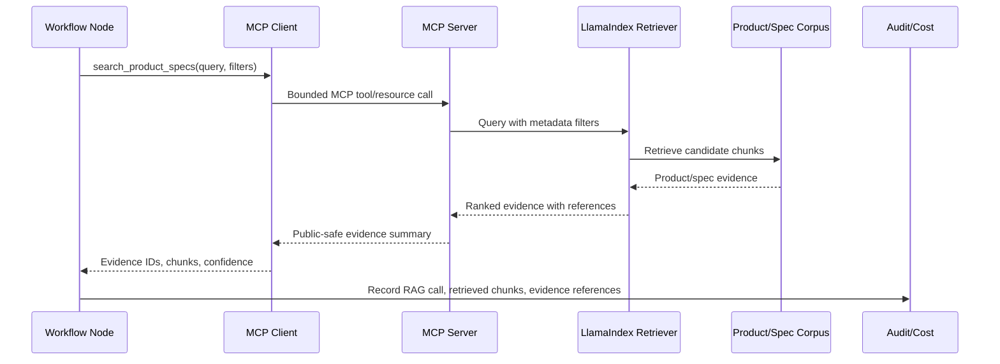
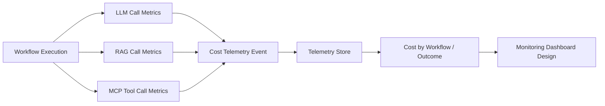
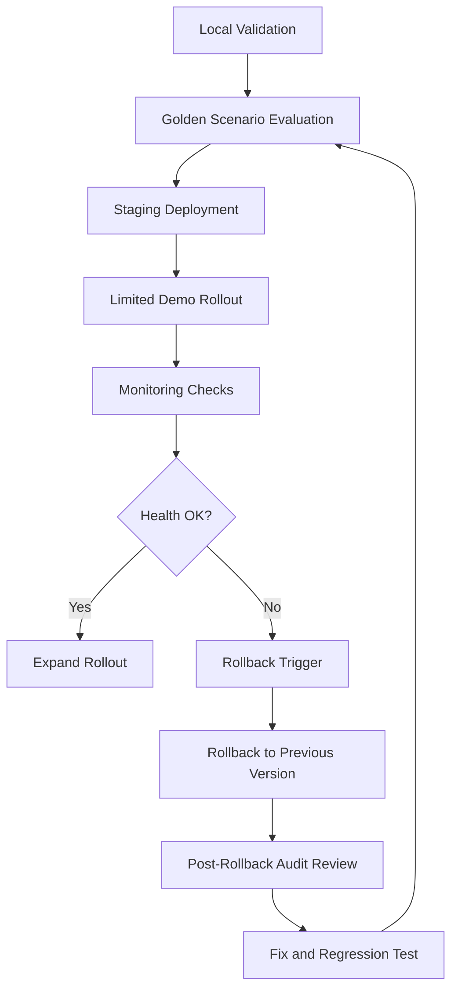

# Field Sales Agent Diagrams

These Mermaid diagrams are public-safe architecture diagrams for the DecisionTrace — Quote Assist Agent reference workflow.

## 1. C4 Context Diagram

## 2. C4 Container Diagram

## 3. Phase 1 Workflow Sequence

## 4. MCP + LlamaIndex Retrieval Sequence

## 5. Cost Telemetry Flow

## 6. Controlled Rollout / Rollback Flow

